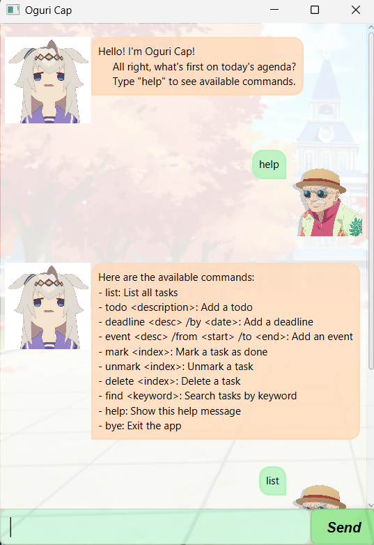

# OguriCap User Guide



Welcome to **OguriCap**, a simple and efficient command-line task manager designed for users who prefer typing commands to manage their tasks.

OguriCap allows you to manage todos, deadlines, and events through clear and structured commands.

---

## Features

OguriCap allows you to:

- Add todos
- Add deadlines
- Add events
- List all tasks
- Mark tasks as done
- Unmark completed tasks
- Delete tasks
- Find tasks by keyword
- View help instructions
- Automatically save and load tasks

---

## Command Format

**Notes about the Command Format**


- Words in UPPER_CASE are parameters to be supplied by the user.  
  e.g. `todo DESCRIPTION`

- Parameters shown as `<parameter>` represent required input.

- Parameters must follow the specified format for each command.

- Commands that do not require parameters (such as `list`, `help`, `bye`) will ignore any extra input.

---

## Commands

### 1. Listing All Tasks

Displays all tasks currently stored.

**Format:**
```
list
```

---

### 2. Adding a Todo

Adds a simple task.

**Format:**
```
todo DESCRIPTION
```

**Example:**
```
todo Review tutorial
```

---

### 3. Adding a Deadline

Adds a task with a deadline.

**Format:**
```
deadline DESCRIPTION /by DATE
```

**Example:**
```
deadline Submit assignment /by 2026-02-20
```

---

### 4. Adding an Event

Adds a task with a start and end time.

**Format:**
```
event DESCRIPTION /from START /to END
```

**Example:**
```
event Project meeting /from 2pm /to 4pm
```

---

### 5. Marking a Task as Done

Marks the specified task as completed.

**Format:**
```
mark INDEX
```

**Example:**
```
mark 2
```

---

### 6. Unmarking a Task

Marks a completed task as not done.

**Format:**
```
unmark INDEX
```

**Example:**
```
unmark 2
```

---

### 7. Deleting a Task

Deletes the specified task.

**Format:**
```
delete INDEX
```

**Example:**
```
delete 3
```

---

### 8. Finding Tasks

Finds tasks containing a given keyword.

**Format:**
```
find KEYWORD
```

**Example:**
```
find meeting
```

---

### 9. Viewing Help

Displays the list of available commands.

**Format:**
```
help
```

---

### 10. Exiting the Application

Closes the OguriCap application.

**Format:**
```
bye
```

---

## Data Storage

Tasks are automatically saved to a local data file.  
When the application is restarted, previously saved tasks will be loaded automatically.

**Note:** Tasks are stored in `data/oguri_cap_tasks.txt` by default.
